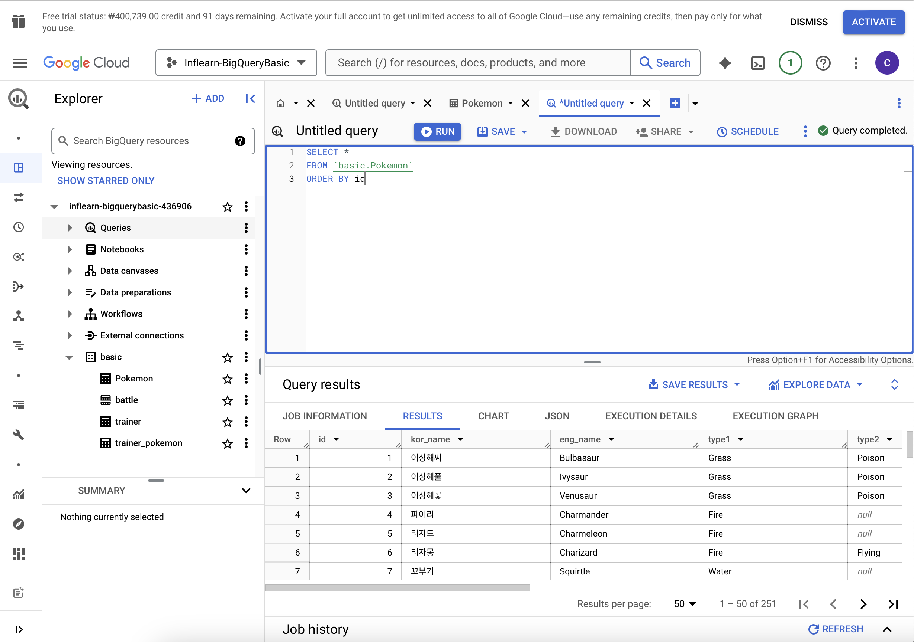

# Big Query 기초 지식

데이터: 보통 데이터베이스 테이블 등에 저장.

Database: 데이터의 저장소 (Oracle, MySQL 등..)

Table: 데이터가 저장된 공간

OLTP: Online Transaction Processing: 거래를 하기 위해 사용되는 데이터베이스. 데이터 추출은 가능하지만, 분석을 위해 만든 데이터베이스가 아니기에 쿼리 속도가 느릴 수 있음.

그래서 등장한 것이?
### OLAP: Online Analytical Processing

-> 분석을 위한 기능 제공.

데이터 웨어하우스: (웹 크롤링, API 결과, Database, 파일 등) 데이터를 한 곳에 모아서 저장.

### Big Query = Goggle Cloud의 OLAP + Data Warehouse
: 클라우드 베이스에서 사용하는 데이터 웨어하우스.
- 장점
    - SQL 사용해서 쉽게 데이터 추출 가능.
    - OLAP 도구이므로 속도가 빠름.
    - Firebase, Google Analytics 4의 데이터가 BigQuery에 자동 저장 되기에 쉽게 추출 가능.
    - 구글에서 인프라를 관리하기에 데이터 웨어하우스 사용을 위해 서버(컴퓨터)를 띄울 필요가 없음.
- 단점: 비용.. 그만큼 비싸다!

# BigQuery 환경 설정

### Big Query 환경 구성 요소
- 프로젝트: 하나의 큰 건물. 여러 목적의 창고가 . 그 내부에 존재함. 하나의 프로젝트에 여러 데이터셋 존재 가능.

- 데이터셋: 프로젝트에 있는 창고. 각 창고 공간에 데이터를 저장. 하나의 데이터셋에 다양한 테이블 존재 가능.

- 테이블: 창고에 있는 선반. 테이블 안엔 행과 열로 이루어진 데이터들이 저장.

### 실행 결과

# 데이터 활용 OVERVIEW

