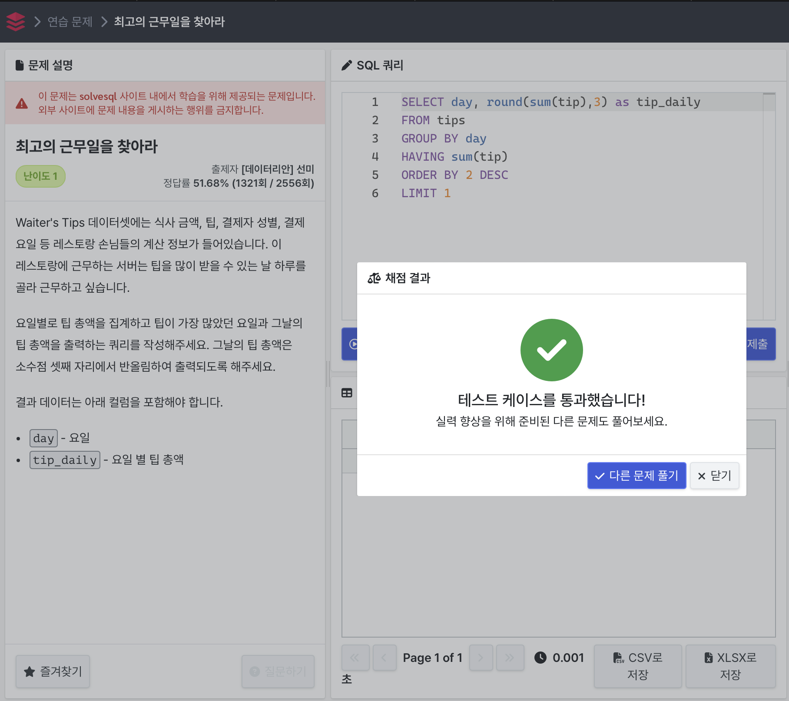

# 우리 플랫폼에 정착한 판매자 1
총 주문이 100건 이상 들어온 판매자 리스트를 출력하는 쿼리를 작성하는 문제.

### 처음 오답 코드
```
Select seller_id, count(order_id) as orders
FROM olist_order_items_dataset
GROUP BY seller_id
HAVING COUNT(order_id) >= 100
```
쿼리 실행은 되지만 오답..!
DISTINCT 문법 사용해서 중복값을 제거해주어야 했음.

### 최종 정답 코드
```
Select seller_id, count(DISTINCT order_id) as orders
FROM olist_order_items_dataset
GROUP BY seller_id
HAVING COUNT(DISTINCT order_id) >= 100
```


주요 문법: COUNT, GROUP BY, HAVING, DISTINCT

# 몇 분이서 오셨어요?
서빙했던 테이블 중 고객이 홀수 명이었던 경우만 보여주는 쿼리를 작성하는 문제.

쿼리 결과에 모든 컬럼이 출력되어야 하기에 select *을 해주면 됨.

홀수는 2로 나누었을 때 나머지가 1인데, mod라는 함수를 사용하면 간단하게 해결.

사실 mod 함수는 이번에 처음 알게된 함수이긴 함..ㅎㅎ 

mod(컬럼,나누고자하는 수) = 나머지;
즉, mod(size,2) = 1;은 size라는 컬럼의 값을 2로 나누었을 때 나머지가 1인 값들만 선택하게 된다. 홀수만 출력된다는 뜻!

### 최종 정답 코드
```
select *
from tips
where mod(size,2) = 1;
```


주요 문법: mod, *

# 최고의 근무일을 찾아라
요일별로 팁 총액을 집계하고 팁이 가장 많았던 요일과 그날의 팁 총액을 출력하는 쿼리를 작성하는 문제였다. 이때, 팁 총액은 소수점 셋째 자리에서 반올림하여 출력되도록 해야한다.

일단 출력 형태의 컬럼이 day, tip_daily 였고, 반올림 출력을 해야하므로 round 함수를 select문에 같이 써준다. 
ROUND(N,k)는 N을 소수점 k 자리에서 반올림함을 의미한 값을 출력한다.

이 문제에서 일단 요일 별로 팁의 총액을 계산하기 위해 group by와 having 절을 사용해주었다. 

가장 많은 팁을 받은 요일 하나만 알면 되므로, 팁 총액을 기준으로 내림차순 정렬해주고, 

limit를 걸어서 하나만 출력해주면 끝!

### 최종 정답 코드
```
SELECT day, round(sum(tip),3) as tip_daily
FROM tips
GROUP BY day
HAVING sum(tip)
ORDER BY 2 DESC
LIMIT 1
```

주요 문법: GROUP BY, HAVING, ORDER BY, LIMIT, ROUND