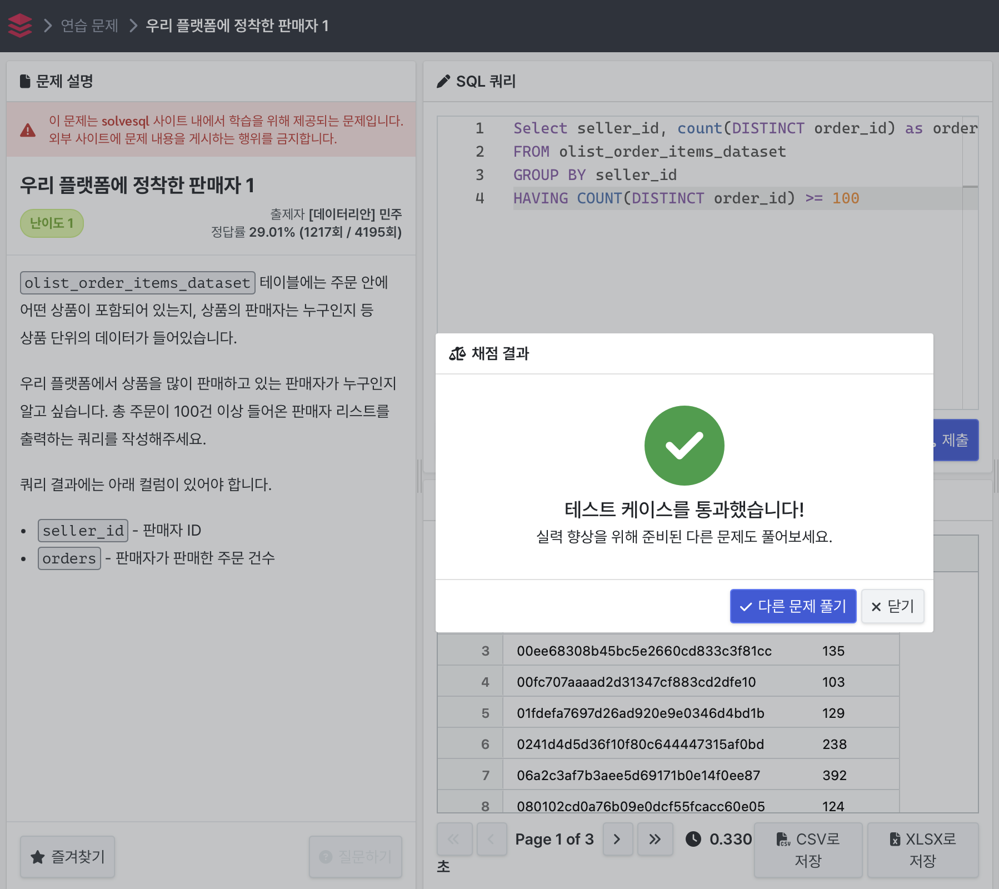
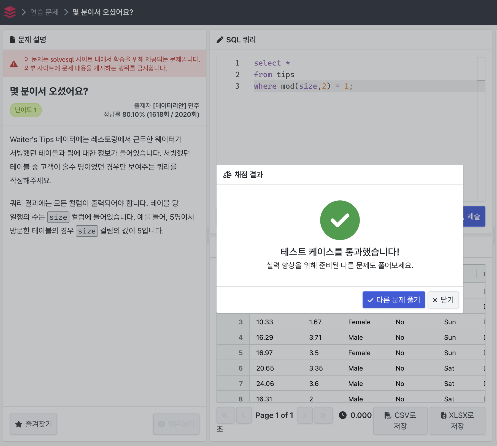

# 우리 플랫폼에 정착한 판매자 1
총 주문이 100건 이상 들어온 판매자 리스트를 출력하는 쿼리를 작성하는 문제.

### 처음 오답 코드
```
Select seller_id, count(order_id) as orders
FROM olist_order_items_dataset
GROUP BY seller_id
HAVING COUNT(order_id) >= 100
```
쿼리 실행은 되지만 오답..!
DISTINCT 문법 사용해서 중복값을 제거해주어야 했음.

### 최종 정답 코드
```
Select seller_id, count(DISTINCT order_id) as orders
FROM olist_order_items_dataset
GROUP BY seller_id
HAVING COUNT(DISTINCT order_id) >= 100
```


주요 문법: COUNT, GROUP BY, HAVING, DISTINCT

# 몇 분이서 오셨어요?
서빙했던 테이블 중 고객이 홀수 명이었던 경우만 보여주는 쿼리를 작성하는 문제.

### 최종 정답 코드
```
select *
from tips
where mod(size,2) = 1;
```



주요 문법: mod, *

# 최고의 근무일을 찾아라

