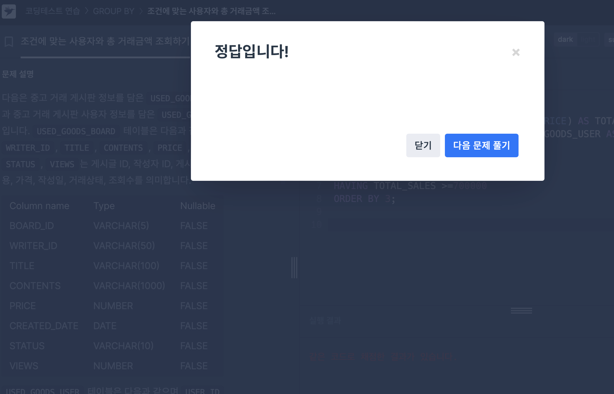
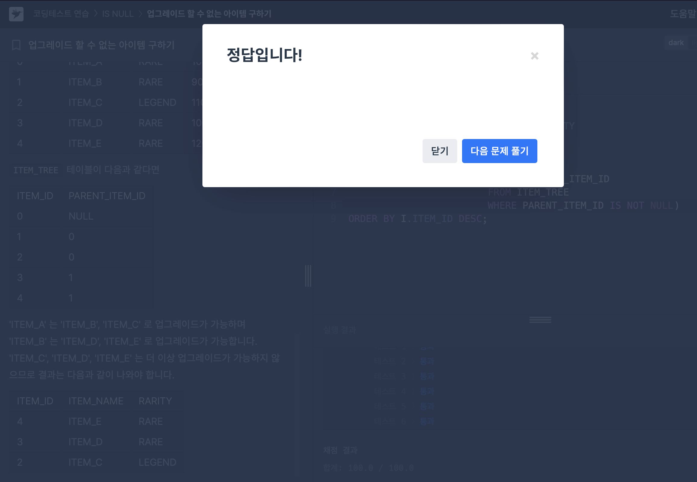
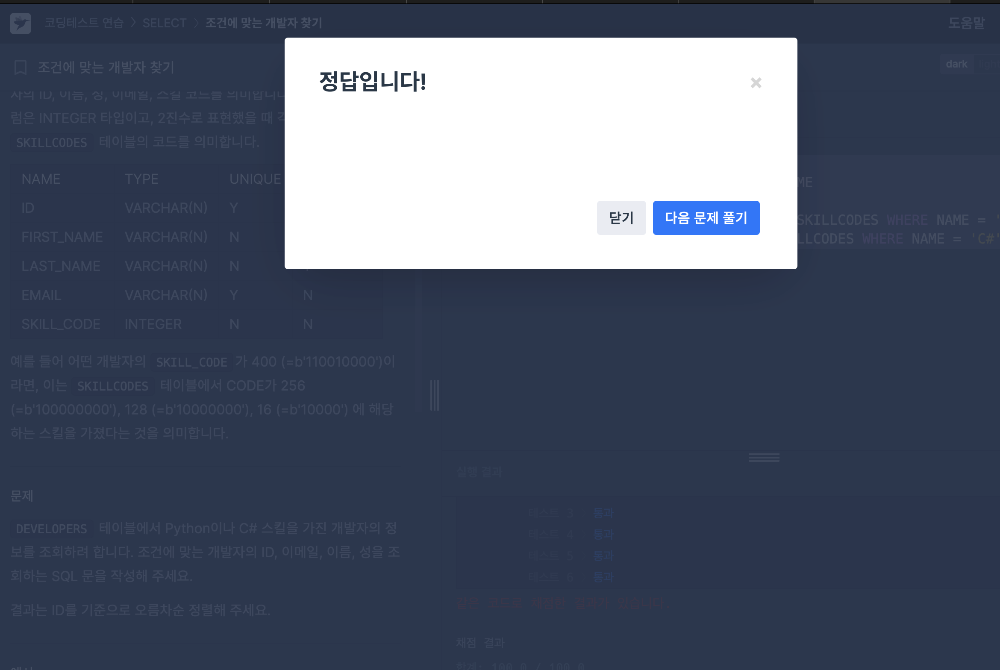

# 조건에 맞는 사용자와 총 거래금액 조회하기

USED_GOODS_BOARD와 USED_GOODS_USER 테이블에서 완료된 중고 거래의 총금액이 70만 원 이상인 사람의 회원 ID, 닉네임, 총거래금액을 조회하는 SQL문을 작성하는 문제였다. 이때, 결과는 총거래금액을 기준으로 오름차순 정렬해야함.

처음 문제 설명을 읽었을 때 두 테이블 간 조인을 할 때 같은 컬럼명을 가지고 있지 않아서 외래키로 사용할 컬럼을 선정해야했다.

이후, 조인을 해주어야 하는데, from 테이블1 join 테이블2을 한 이후 ON을 사용해서 테이블을 이을 조건을 설정해준다.

그 이후에 거래 완료 상태인 조건을 걸고, 유저 아이디 별로 그룹을 나눈 이후 

그룹 별로 총 거래 금액의 합이 700000보다 큰 값을 출력해주면 된다.

크게 어렵진 않았지만 처음에 조인을 걸 때 조금 헷갈렸던 것 같다.

별칭(aliias) 사용법도 연습해볼 수 있어서 좋았음!

### 최종 정답 코드
```
SELECT U.USER_ID, U.NICKNAME, SUM(B.PRICE) AS TOTAL_SALES
FROM USED_GOODS_BOARD AS B JOIN USED_GOODS_USER AS U
ON U.USER_ID = B.WRITER_ID
WHERE STATUS = 'DONE'
GROUP BY U.USER_ID
HAVING TOTAL_SALES >=700000
ORDER BY 3;
```



주요 문밥: join, group by, having

# 업그레이드 할 수 없는 아이템 구하기

더 이상 업그레이드할 수 없는 아이템의 아이템 ID(ITEM_ID), 아이템 명(ITEM_NAME), 아이템의 희귀도(RARITY)를 출력하는 SQL 문을 작성하고 이때 결과는 아이템 ID를 기준으로 내림차순 정렬을 해야하는 문제였다.

일단 테이블 조인을 하고, IS NOT NULL 문법과 서브쿼리까지 사용해야해서 조금 어렵고 복잡했던 문제였던 것 같다.

그리고 NOT IN 문법에 대해 알게되었는데, 이 문법은 꼭 서브쿼리나 상수 목록에 사용해야한다고 한다!

### 최종 정답 코드
```
SELECT I.ITEM_ID, I.ITEM_NAME, I.RARITY
FROM ITEM_INFO I 
INNER JOIN ITEM_TREE T 
ON I.ITEM_ID = T.ITEM_ID
WHERE T.ITEM_ID NOT IN (SELECT PARENT_ITEM_ID 
                        FROM ITEM_TREE
                        WHERE PARENT_ITEM_ID IS NOT NULL)
ORDER BY I.ITEM_ID DESC;
```



주요 문법: join, IS NOT NULL, NOT IN, 서브쿼리 등

# 조건에 맞는 개발자 찾기

DEVELOPERS 테이블에서 Python이나 C# 스킬을 가진 개발자의 정보를 조회하는 문제이다. 
그리고 최종 결과는 ID를 기준으로 오름차순 정렬해야한다.

비트와 연산자에 대해 알아가는 문제였다.
조금 낯설어서 검색을 하면서 풀었던 것 같다.

& 연산자를 사용하면 10진수 숫자들이 내부적으로 2진수로 변환된 후 비트별로 AND 연산이 수행된다.


### 최종 정답 코드
```
SELECT ID, EMAIL, FIRST_NAME, LAST_NAME
FROM DEVELOPERS
WHERE SKILL_CODE & (SELECT CODE FROM SKILLCODES WHERE NAME = 'Python')
OR SKILL_CODE & (SELECT CODE FROM SKILLCODES WHERE NAME = 'C#')
ORDER BY ID
```



주요 문법: & 연산자
