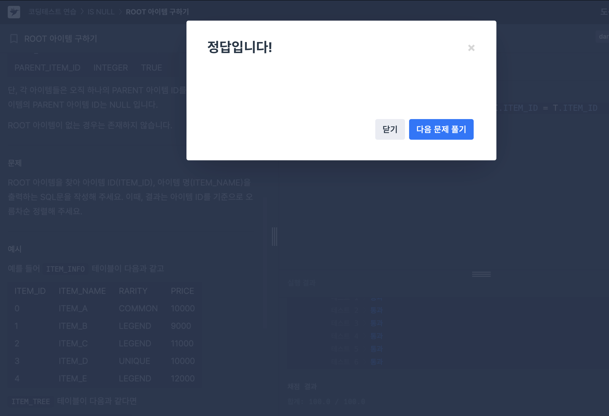

# ROOT 아이템 구하기

ROOT 아이템을 찾아 아이템 ID(ITEM_ID), 아이템 명(ITEM_NAME)을 출력하는  문제. 이때, 결과는 아이템 ID를 기준으로 오름차순 정렬해주어야 한다.

ROOT ITEM은 PARENT_ID 값이 NULL값이므로 IS NULL 함수를 사용해서 간단하게 해결할 수 있는 문제였다. JOIN 조건만 잘 써주면 됨!

### 최종 정답 코드
```
SELECT T.ITEM_ID, I.ITEM_NAME
FROM ITEM_INFO I JOIN ITEM_TREE T 
ON I.ITEM_ID = T.ITEM_ID
WHERE T.PARENT_ITEM_ID IS NULL
ORDER BY 1
```

주요 문법: JOIN, IS NULL

# 노선별 평균 역 사이 거리 조회하기

SUBWAY_DISTANCE 테이블에서 총 누계 거리, 평균 역 사이 거리를 노선별로 조회하는 문제였다.

여기서 중요한 문법은 CONCAT, ROUND, 그리고 각종 집계함수 였던 것 같다.

한 가지 주의할 점은 ORDER BY를 SUM(D_BETWEEN_DIST)대신 2를 쓰면 오답 처리 된다는 점.

ORDER BY는 별칭이 적용된 열을 올바르게 인식하지 못할 수 있음. SQL에서 ORDER BY에서 사용하는 인덱스는 실제 열의 인덱스를 기준으로 하는데, CONCAT이나 계산식이 포함되면 이를 제대로 처리하지 못하는 경우가 존재.
### 최종 정답 코드
```
SELECT ROUTE, 
CONCAT(ROUND(SUM(D_BETWEEN_DIST), 1), 'km') as TOTAL_DISTANCE, 
CONCAT(ROUND(AVG(D_BETWEEN_DIST), 2), 'km') as AVERAGE_DISTANCE
FROM SUBWAY_DISTANCE
GROUP BY ROUTE
ORDER BY SUM(D_BETWEEN_DIST) DESC;
```

주요 문법: CONCAT, ROUND, SUM, AVG


# 헤비 유저가 소유한 장소

이 서비스에서는 공간을 둘 이상 등록한 사람을 "헤비 유저"라고 부르는데, 헤비 유저가 등록한 공간의 정보를 아이디 순으로 조회하는 SQL문을 작성하는 문제였다.

어떤 유저를 헤비유저로 파악하여 조회할지를 중심으로 생각해야했는데, 그 과정에서 IN절을 사용해줄 수 있다.

코드는 짧고 단순하지만.. 집중하지 않으면 생각보다 뭐를 COUNT 해야하는지 살짝 헷갈렸었음..

### 최종 정답 코드
```
SELECT *
FROM PLACES
WHERE HOST_ID IN(SELECT HOST_ID
                FROM PLACES
                GROUP BY HOST_ID
                HAVING COUNT(ID)>=2)
ORDER BY 1
```

주요 문법: IN, GROUP BY, HAVING, COUNT