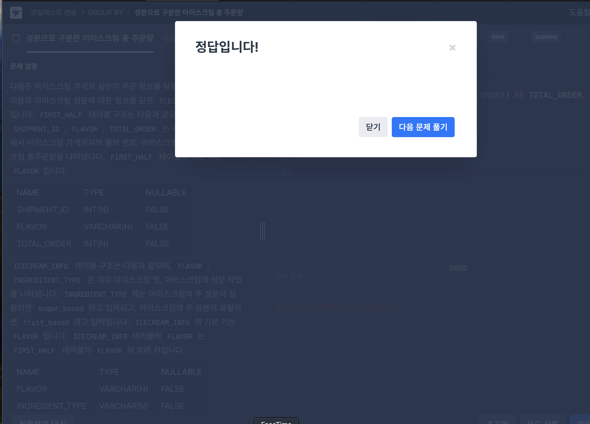
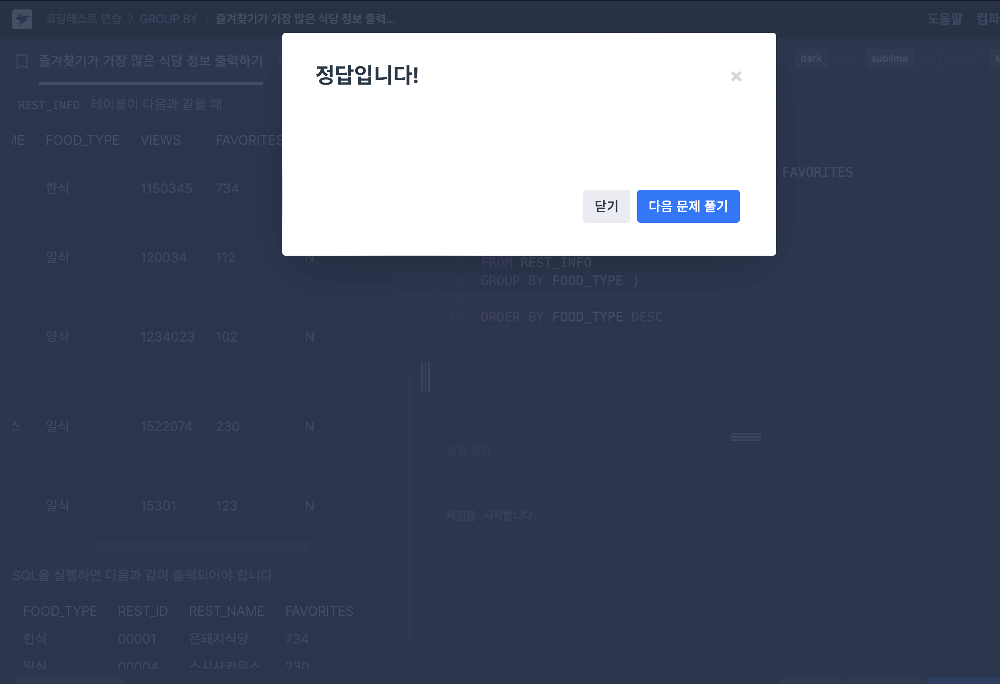
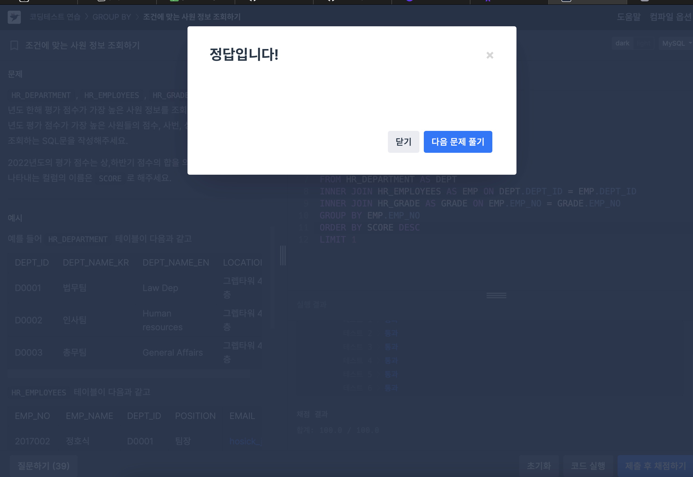

# [JOIN] 성분으로 구분한 아이스크림 총 주문량
상반기 동안 각 아이스크림 성분 타입과 성분 타입에 대한 아이스크림의 총주문량을 총주문량이 작은 순서대로 조회하는 SQL 문을 작성하는 문제이다.
join을 사용해서 group by를 해주면 간단히 해결할 수 있는 문제였다. 또한 총주문량 계산을 위해 sum 집계함수를 사용해주면 됐다.

### 최종 정답 코드
```
SELECT I.INGREDIENT_TYPE, SUM(F.TOTAL_ORDER) AS TOTAL_ORDER
FROM FIRST_HALF as F
JOIN ICECREAM_INFO as I
ON F.FLAVOR = I.FLAVOR
GROUP BY I.INGREDIENT_TYPE
ORDER BY TOTAL_ORDER
```

주요 사용 문법: join, group by, sum


# [MAX] 즐겨찾기가 가장 많은 식당 정보 출력하기
REST_INFO 테이블에서 음식종류별로 즐겨찾기수가 가장 많은 식당의 음식 종류, ID, 식당 이름, 즐겨찾기수를 조회하는 SQL문을 작성하는 문제이다. 음식 종류를 기준으로 내림차순 정렬 해주어야 함.

여기서 주의할 점은 MAX 함수가 아닌 서브쿼리를 이용해야 한다는 점이다. 서브쿼리를 사용해줘야 하는 이유는 GROUP BY는 MAX함수까지 커버해줄 수 없기 때문이다. 최빈값이 아닌, 최상단의 값을 그냥 출력한다. 따라서 서브쿼리를 사용해서 해줘야 함.

### 최종 정답 코드
```
SELECT FOOD_TYPE, REST_ID, REST_NAME, FAVORITES
FROM REST_INFO
WHERE (FOOD_TYPE, FAVORITES) 
IN 
(SELECT FOOD_TYPE, MAX(FAVORITES)
FROM REST_INFO
GROUP BY FOOD_TYPE )
ORDER BY FOOD_TYPE DESC
```

주요 사용 문법: 서브쿼리


# [WINDOW] 조건에 맞는 사원 정보 조회하기
HR_DEPARTMENT, HR_EMPLOYEES, HR_GRADE 테이블에서 2022년도 한해 평가 점수가 가장 높은 사원 정보를 조회하려 합니다. 2022년도 평가 점수가 가장 높은 사원들의 점수, 사번, 성명, 직책, 이메일을 조회하는 SQL문을 작성해야하는 문제. 

나는 세 테이블을 먼저 조인해주고, group by를 해준 후 평가 점수는 HR_GRADE 테이블에서 확인할 수 있으므로 거기서 제일 평가 점수가 높은 사원을 출력해주기 위해 limit와 order by desc 를 사용해주었다.

여기서 주의해야할 점은 평가점수가 상 하반기 점수의 합을 의미하므로, select에 sum을 사용해주어야 하고, group by는 일반적으로 집계함수와 함께 쓰이므로 항상 주의해야 함!

### 최종 정답 코드
```
SELECT SUM(GRADE.SCORE) AS SCORE,
       EMP.EMP_NO,
       EMP.EMP_NAME,
       EMP.POSITION,
       EMP.EMAIL
FROM HR_DEPARTMENT AS DEPT
INNER JOIN HR_EMPLOYEES AS EMP ON DEPT.DEPT_ID = EMP.DEPT_ID
INNER JOIN HR_GRADE AS GRADE ON EMP.EMP_NO = GRADE.EMP_NO
GROUP BY EMP.EMP_NO
ORDER BY SCORE DESC
LIMIT 1
```

주요 사용문법: sum, join, group by, order by, limit