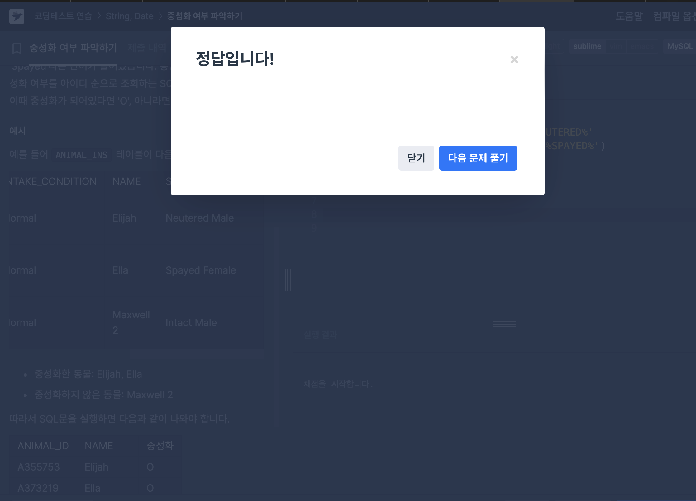

# [ISNULL] NULL처리하기 (SQL 고득점kit)
### 1. IFNULL()으로 해결

```
입양 게시판에 동물 정보를 게시하려 합니다. 
동물의 생물 종, 이름, 성별 및 중성화 여부를 아이디 순으로 조회하는 SQL문을 작성해주세요. 
이때 프로그래밍을 모르는 사람들은 NULL이라는 기호를 모르기 때문에, 이름이 없는 동물의 이름은 "No name"으로 표시해 주세요.
```
IFNULL(A,B)는 A가 NULL이 아니면 A를, NULL이면 B를 출력한다. 

이를 이용하면 아주 간단하게 해결할 수 있는 문제!

최종 코드는 아래와 같다.
```
SELECT ANIMAL_TYPE, IFNULL(NAME, 'No name'), SEX_UPON_INTAKE
FROM ANIMAL_INS
ORDER BY ANIMAL_ID
```

주요 사용 문법: IFNULL

### 2. CASE WHEN으로 해결
```
입양 게시판에 동물 정보를 게시하려 합니다. 
동물의 생물 종, 이름, 성별 및 중성화 여부를 아이디 순으로 조회하는 SQL문을 작성해주세요. 
이때 프로그래밍을 모르는 사람들은 NULL이라는 기호를 모르기 때문에, 이름이 없는 동물의 이름은 "No name"으로 표시해 주세요.
```
같은 문제를 CASE WHEN으로 푼다면?

CASE WHEN A THEN B, ELSE C END AS D

A이면 B, 아니면 C, 그리고 그 값들을 D라는 컬럼에 저장.

이 문법을 사용하면 최종 코드는 아래와 같다.
```
SELECT 
    ANIMAL_TYPE, 
    CASE 
        WHEN NAME IS NULL THEN 'No name' 
        ELSE NAME 
    END AS NAME, 
    SEX_UPON_INTAKE
FROM 
    ANIMAL_INS
ORDER BY 
    ANIMAL_ID;
```

주요 사용 문법: CASE WHEN


# [IF, LIKE] 중성화 여부 파악하기
```
보호소의 동물이 중성화되었는지 아닌지 파악하려 합니다.
중성화된 동물은 SEX_UPON_INTAKE 컬럼에 'Neutered' 또는 'Spayed'라는 단어가 들어있습니다.
동물의 아이디와 이름, 중성화 여부를 아이디 순으로 조회하는 SQL문을 작성해주세요. 
이때 중성화가 되어있다면 'O', 아니라면 'X'라고 표시해주세요.
```
like 혹은 in 문법을 사용해 해결할 수 있다.

like와 in의 차이는 in은 정확한 값을 명시해야하고, like는 %를 이용해서 포함하는 값을 모두 출력할 수 있다.

문제에서 중성화를 한 경우 특정 단어를 '포함'한다고 했기에, like를 사용해주는 것이 더 적절해 보인다.

나는 case when 문법과 like를 함께 사용해주었다.

최종 정답 코드는 아래와 같다.
```
SELECT ANIMAL_ID, NAME,
CASE WHEN (SEX_UPON_INTAKE LIKE '%NEUTERED%' 
           OR SEX_UPON_INTAKE LIKE '%SPAYED%') 
THEN 'O' ELSE 'X' END AS '중성화'
FROM ANIMAL_INS
ORDER BY ANIMAL_ID ASC
```

주요 사용 문법: CASE WHEN, LIKE

## 틀린 코드 이유 찾기
#### 틀린 코드


IF 구문에서 OR 조건을 쓸 때 주의해야 할 부분은 조건이 각기 독립적으로 평가되도록 적어야 한다는 점이다.

사진 속 코드에서 발생한 문제는 LIKE 구문이 각각의 조건에 대해 독립적으로 평가되지 않았기 때문인데,
```
IF (sex_upon_intake LIKE '%Neutered%' OR '%Spayed%', 'O', 'X')
```
이 구문에서 문제가 되는 부분은 '%Spayed%'가 LIKE 없이 독립적으로 존재하는 것이다. 

SQL에서는 이처럼 조건이 없는 문자열 ('%Spayed%')을 논리적 표현으로 해석할 수 없다. 

SQL은 각 조건을 독립적으로 평가해야 하기 때문에, 이 경우 SQL 엔진이 '%Spayed%' 자체를 TRUE 또는 FALSE로 해석하지 못한다.

따라서,
```
IF (sex_upon_intake LIKE '%Neutered%' OR sex_upon_intake LIKE '%Spayed%', 'O', 'X')
```
이렇게 작성해줘야 sex_upon_intake가 각각의 LIKE 조건과 독립적으로 비교되기 때문에, SQL에서 정확하게 'Neutered' 또는 'Spayed'가 포함된지를 확인할 수 있다.