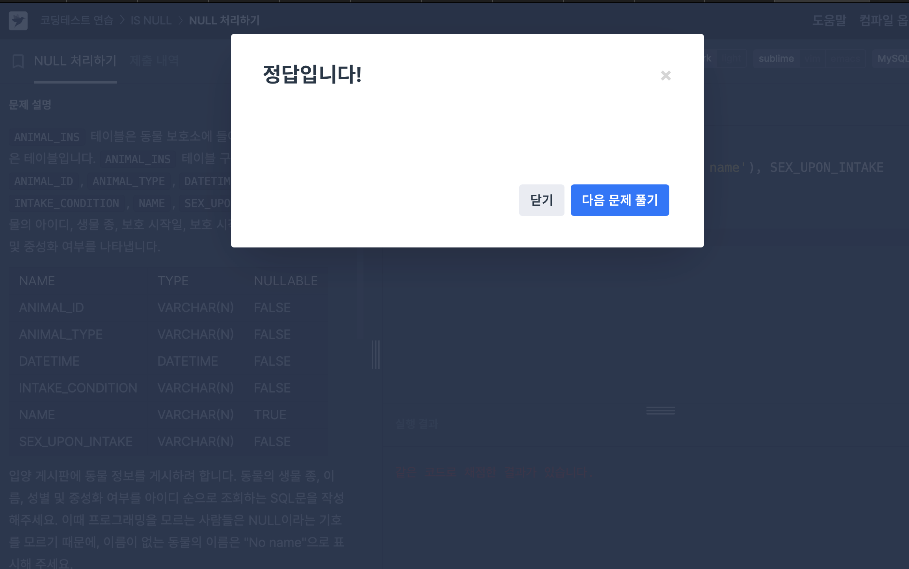
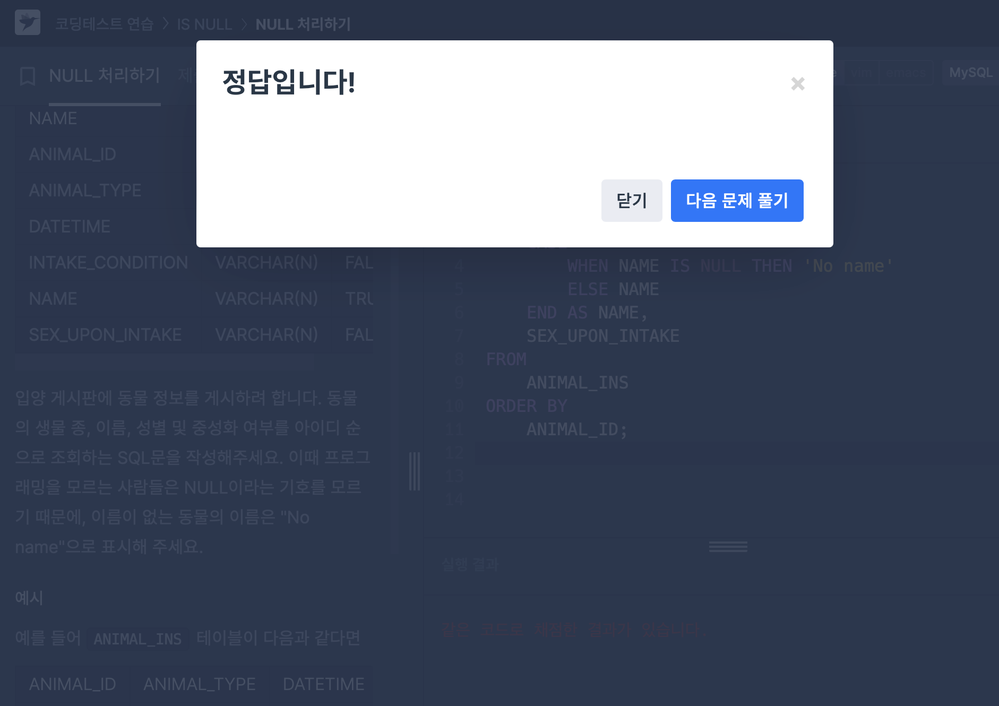
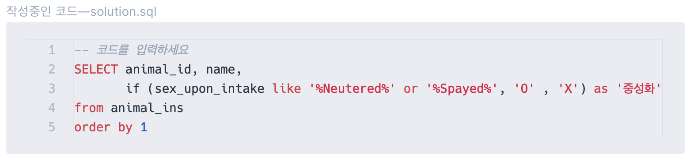

# [ISNULL] NULL처리하기 (SQL 고득점kit)
### 1. IFNULL()으로 해결

```
입양 게시판에 동물 정보를 게시하려 합니다. 
동물의 생물 종, 이름, 성별 및 중성화 여부를 아이디 순으로 조회하는 SQL문을 작성해주세요. 
이때 프로그래밍을 모르는 사람들은 NULL이라는 기호를 모르기 때문에, 이름이 없는 동물의 이름은 "No name"으로 표시해 주세요.
```
IFNULL(A,B)는 A가 NULL이 아니면 A를, NULL이면 B를 출력한다. 

이를 이용하면 아주 간단하게 해결할 수 있는 문제!

최종 코드는 아래와 같다.
```
SELECT ANIMAL_TYPE, IFNULL(NAME, 'No name'), SEX_UPON_INTAKE
FROM ANIMAL_INS
ORDER BY ANIMAL_ID
```

주요 사용 문법: IFNULL

### 2. CASE WHEN으로 해결
```
입양 게시판에 동물 정보를 게시하려 합니다. 
동물의 생물 종, 이름, 성별 및 중성화 여부를 아이디 순으로 조회하는 SQL문을 작성해주세요. 
이때 프로그래밍을 모르는 사람들은 NULL이라는 기호를 모르기 때문에, 이름이 없는 동물의 이름은 "No name"으로 표시해 주세요.
```
같은 문제를 CASE WHEN으로 푼다면?

CASE WHEN A THEN B, ELSE C END AS D

A이면 B, 아니면 C, 그리고 그 값들을 D라는 컬럼에 저장.

이 문법을 사용하면 최종 코드는 아래와 같다.
```
SELECT 
    ANIMAL_TYPE, 
    CASE 
        WHEN NAME IS NULL THEN 'No name' 
        ELSE NAME 
    END AS NAME, 
    SEX_UPON_INTAKE
FROM 
    ANIMAL_INS
ORDER BY 
    ANIMAL_ID;
```

주요 사용 문법: CASE WHEN


# [IF, LIKE] 중성화 여부 파악하기

## 틀린 코드 이유 찾기
#### 틀린 코드
